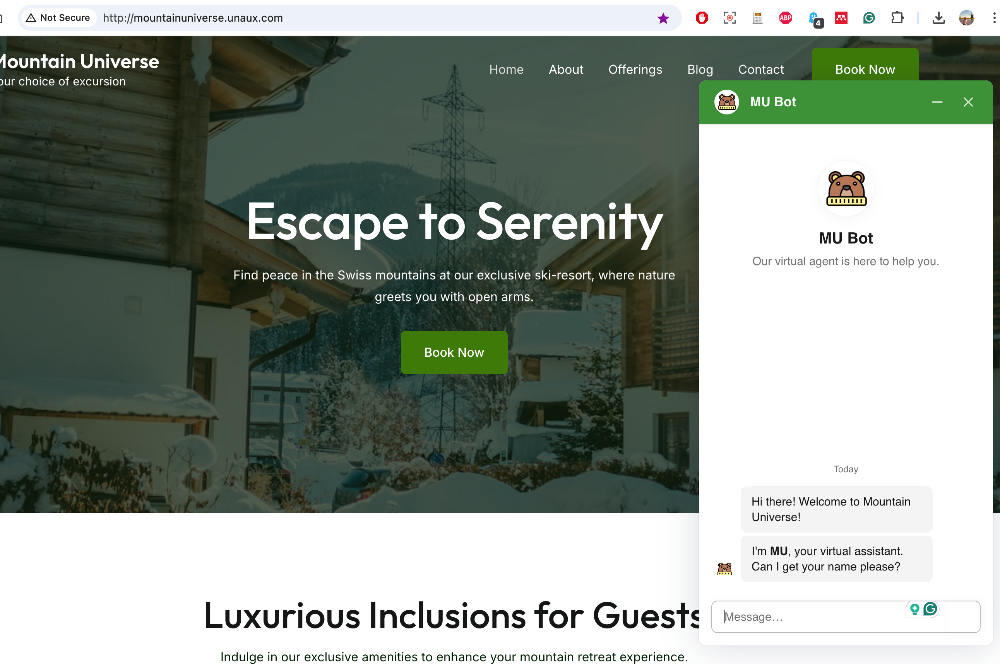
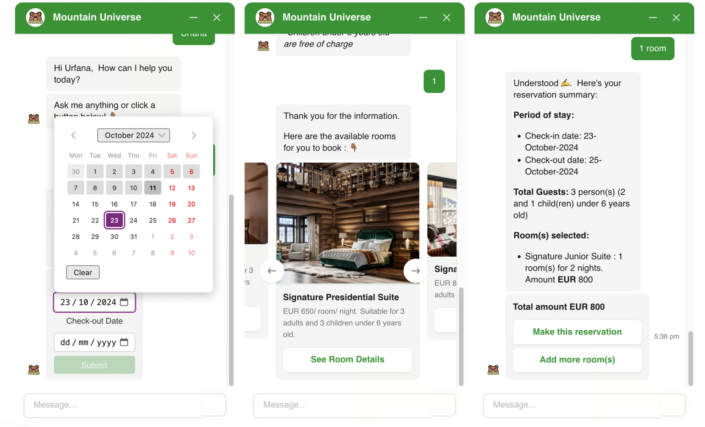
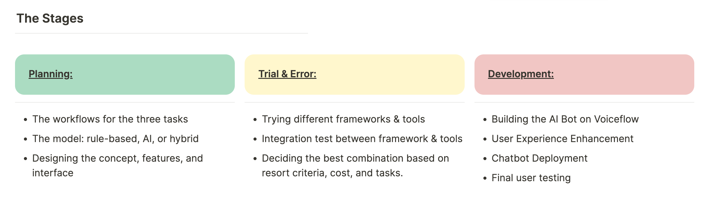
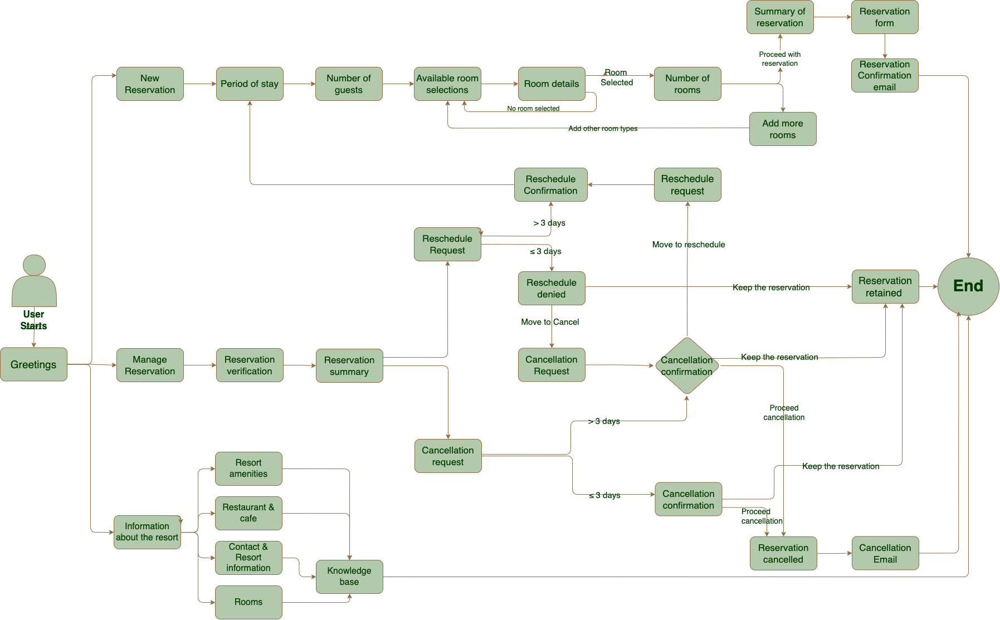
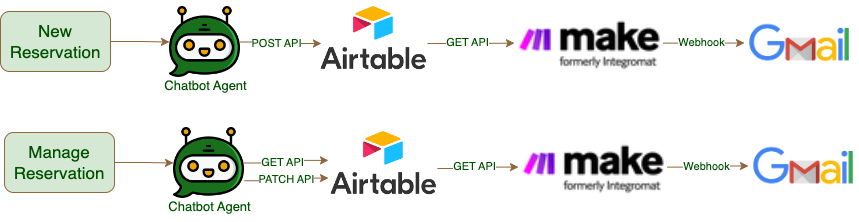
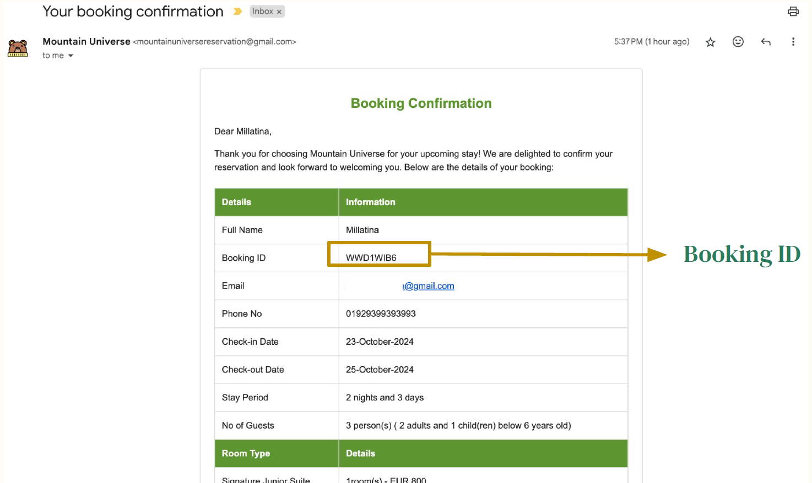
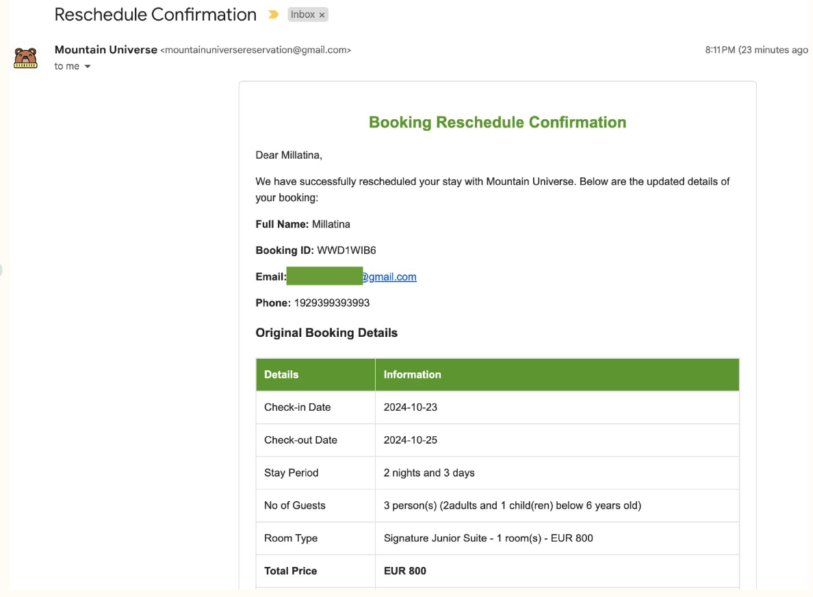

<h1 align="center">AI Chatbot for Exclusive Ski Resort

</h1>

    
   
  <em>Example of MU Bot Designs</em>

This AI-Chatbot was built using Voiceflow. You can test out the demo from Vercel here: 
🚀 <a href="https://resort-ai-chatbot-omega.vercel.app"><b>Live Demo</b></a>  

## Business Problem
Mountain Universe Resort is a all-inclusive, well-known boutique ski resort in Switzerland. They had received inquires 24/7 about new reservations, rescheduling and cancellations, and frequently asked questions about the resorts itself such as their amenities, rooms, restaurants, etc. Having an AI chatbot to do these tasks would help Mountain Universe resort to reduce repetitive manual tasks and increase conversion booking rate by having this seamless reservation experience, especially during outside local working hours.

## The Development Stages

   
  <em>The Development Stages </em>

#### Fun Fact!
I chose the name Mountain Universe and MU Bot to match my initial MU! 😝

## The Chatbot Workflows

MU Bot has three  main workflows which are:

1. Make new reservations; 
2. Manage their reservations: canceling or rescheduling;
3. Resort Information: answer FAQ about the resort, such as its amenities, restaurants and cafe, rooms and contact information.

   
  <em>The Workflow of MU Bot </em>

## The Model
- Rule-based Model: predefined rules that gives pre-defined answers which applied to questions that needs answers to be accurate.
- Artificial Intelligence: Natural Language Understanding (NLU) is by utilizing of the knowledge base to recognize and understand the users’ intents before activating the rule-based model.

## Framework & Tools:

   
  <em>The Framework and Tools </em>

- Voiceflow was as the framework where AI chatbot agent was developed
- Airtable served as guests database where guests and reservation details stored and retrieved through API
- Make.com was the integration platform that fetched information from Airtable and using webhook to send booking confirmation emails via Gmail

## Email Confirmation

Whatever the completed action taken by the user is, whether making new reservation, reschedule, or cancellation, the user will get email confirmation, like shown below:

    
   
  <em>Automated Email Confirmation </em>

